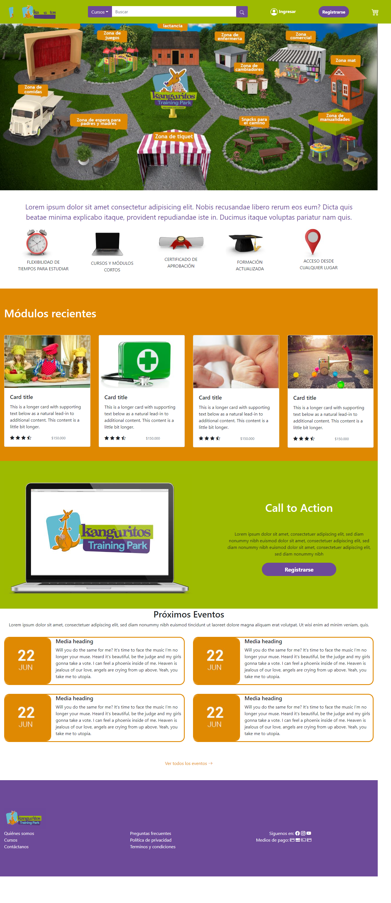
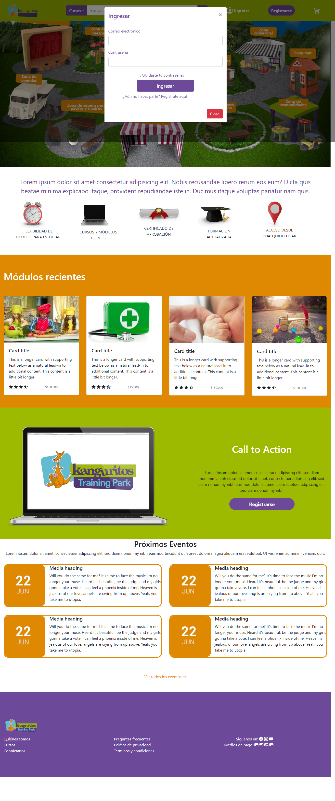
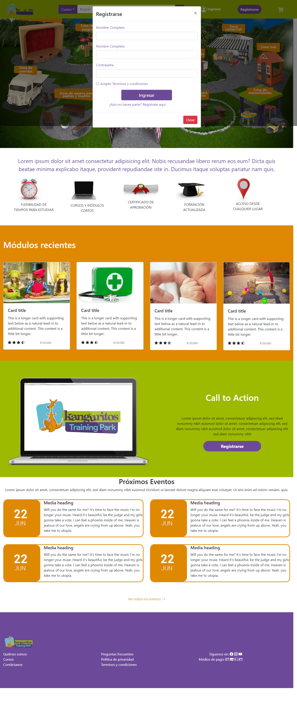

# PruebaTecnicaFrontEndMaquetacion
Prueba técnica para el sitio web de una guardería, en el cual se realiza un proceso de maquetación usando tecnologías como: HTML, CSS y Bootstrap 4.5. El sitio consta de un navBar con su logotipo corporativo y su respectivo menú, además en él se maneja un layout con la gird responsiva de bootstrap para ubicar y distribuir de mejor manera los elementos en la pagina web. Algunos de los componentes de bootstrap para el desarrollo de este entorno son: cards, slider, y modals. 

---
## Modelo Ordenador
En el modelo ordenador se trabajó una dimensión de los elementos para que se adapten al dispositivo y así brindarle una mejor visualización al usuario, de igual forma en ella se puede visualizar la adaptación de imágenes, iconos, menús entre otros tamaños de los elementos utilizados.

---
## Modal Ingresar 
Se trabajó un modal para el botón de ingresar con el fin de que este le muestre al usuario un formulario con los campos correo electrónico y contraseña con el fin de que el usuario pueda entrar al sitio.

---
## Modal Registro
Se trabajó un modal para el botón de registro con el fin de que este le muestre al usuario un formulario con los campos Nombre completo y contraseña con el fin de que el usuario pueda registrarse y entrar al sitio.

## Lenguajes Usados

|logo | lenguaje|
|-------|--------|
|   | BOOTSTRAP |
|   | CSS |
|   | Java |